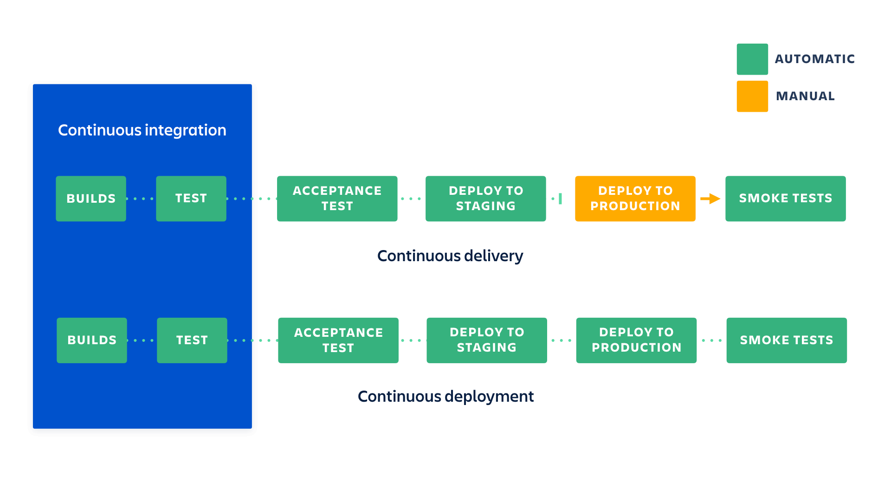
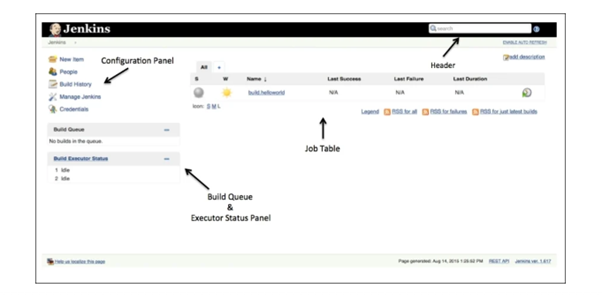
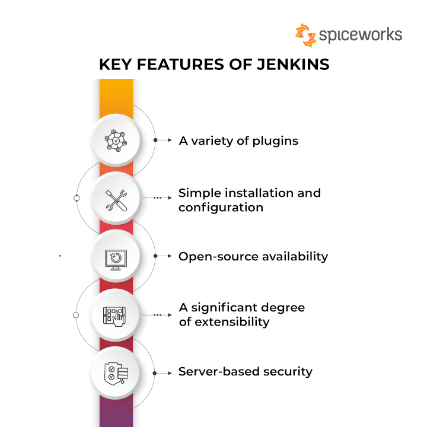

## What is CI/CD?
### Overview
CI/CD is a method to frequently deliver apps to customers by introducing automation into the stages of app development. The main concepts attributed to CI/CD are continuous integration, continuous delivery, and continuous deployment. CI/CD is a solution to the problems integrating new code can cause for development and operations teams (AKA "integration hell"). 
Specifically, CI/CD introduces ongoing automation and continuous monitoring throughout the lifecycle of apps, from integration and testing phases to delivery and deployment. Taken together, these connected practices are often referred to as a "CI/CD pipeline".
### Continuous integration
Developers practicing continuous integration merge their changes back to the main branch as often as possible. The developer's changes are validated by creating a build and running automated tests against the build. By doing so, you avoid integration challenges that can happen when waiting for release day to merge changes into the release branch.
Continuous integration puts a great emphasis on testing automation to check that the application is not broken whenever new commits are integrated into the main branch.
### Continuous delivery
>[Continuous delivery](https://www.atlassian.com/continuous-delivery) is an extension of continuous integration since it automatically deploys all code changes to a testing and/or production environment after the build stage.
This means that on top of automated testing, you have an automated release process and you can deploy your application any time by clicking a button.
In theory, with continuous delivery, you can decide to release daily, weekly, fortnightly, or whatever suits your business requirements. However, if you truly want to get the benefits of continuous delivery, you should deploy to production as early as possible to make sure that you release small batches that are easy to troubleshoot in case of a problem.
### Continuous deployment
Continuous deployment goes one step further than continuous delivery. With this practice, every change that passes all stages of your production pipeline is released to your customers. There's no human intervention, and only a failed test will prevent a new change to be deployed to production.
Continuous deployment is an excellent way to accelerate the feedback loop with your customers and take pressure off the team as there isn't a "release day" anymore. Developers can focus on building software, and they see their work go live minutes after they've finished working on it.

### Some popular CI/CD tools
- [GitLab CI/CD](https://docs.gitlab.com/ee/ci/)
- [Azure DevOps](https://azure.microsoft.com/en-us/services/devops/pipelines/)
- [GitHub's Actions](https://github.com/features/actions)
- [CircleCI](https://circleci.com/)
- [Jenkins](https://www.jenkins.io/)
- [Travis CI](https://travis-ci.org/)
- [Bitbucket pipeline](https://bitbucket.org/product/features/pipelines)
- [TeamCity](https://www.jetbrains.com/teamcity/)
## Jenkins
### What Is Jenkins?
Jenkins is an open-source solution comprising an automation server to enable continuous integration and continuous delivery (CI/CD), automating the various stages of software development such as build, test, and deployment.

### Key Features of Jenkins

#### A variety of plugins
- Jenkins plugins are extensions to the Jenkins system. Providing integration points for [CI/CD tools,](https://www.spiceworks.com/tech/devops/articles/best-cicd-tools/ "CI/CD tools,") sources and destinations is among the most prevalent plugin applications.
- They also aid with the expansion of Jenkins’ capabilities as well as the integration of Jenkins with other software. Plugins may be downloaded and installed using the Jenkins Web UI or CLI from the Jenkins Plugin repository.
- Nowadays, the Jenkins community reports that there are around 1,500 plugins available for a variety of applications.
#### Simple installation and configuration
- Jenkins is a self-contained Java software that doesn’t care about the platform it’s running on. It runs on all standard operating systems, including Windows, Unix versions, and Mac OS. 
- Jenkins’ online interface is simple to set up and configure, including error checks and a built-in help feature.
#### Extensibility
Jenkins can be extended via its plugin architecture, providing nearly infinite possibilities for what Jenkins can do.
### Jenkins Pipeline
> Jenkins Pipeline (or simply "Pipeline" with a capital "P") is a suite of plugins which supports implementing and integrating _continuous delivery pipelines_ into Jenkins.
#### Jenkinsfile
The definition of a Jenkins Pipeline is written into a text file (called a [`Jenkinsfile`](https://www.jenkins.io/doc/book/pipeline/jenkinsfile)) which in turn can be committed to a project’s source control repository.
A `Jenkinsfile` can be written using two types of syntax — Declarative and Scripted.
Declarative and Scripted Pipelines are constructed fundamentally differently. Declarative Pipeline is a more recent feature of Jenkins Pipeline which:
- provides richer syntactical features over Scripted Pipeline syntax, and
- is designed to make writing and reading Pipeline code easier.
#### Pipeline concepts
##### Pipeline
A Pipeline is a user-defined model of a CD pipeline. A Pipeline’s code defines your entire build process, which typically includes stages for building an application, testing it and then delivering it.
##### Node
A node is a machine which is part of the Jenkins environment and is capable of executing a Pipeline.
Also, a `node` block is a [key part of Scripted Pipeline syntax](https://www.jenkins.io/doc/book/pipeline/#scripted-pipeline-fundamentals).
##### Stage
A `stage` block defines a conceptually distinct subset of tasks performed through the entire Pipeline (e.g. "Build", "Test" and "Deploy" stages), which is used by many plugins to visualize or present Jenkins Pipeline status/progress. [[6](https://www.jenkins.io/doc/book/pipeline/#_footnotedef_6 "View footnote.")]
##### Step
A single task. Fundamentally, a step tells Jenkins _what_ to do at a particular point in time (or "step" in the process). For example, to execute the shell command `make`, use the `sh` step: `sh 'make'`. When a plugin extends the Pipeline DSL, [[1](https://www.jenkins.io/doc/book/pipeline/#_footnotedef_1 "View footnote.")] that typically means the plugin has implemented a new _step_.
```groovy
Jenkinsfile (Declarative Pipeline)
pipeline {
    agent any 
    stages {
        stage('Build') { 
            steps {
                // 
            }
        }
        stage('Test') { 
            steps {
                // 
            }
        }
        stage('Deploy') { 
            steps {
                // 
            }
        }
    }
}
```
## Github Actions
GitHub Actions is a continuous integration and continuous delivery (CI/CD) platform that allows you to automate your build, test, and deployment pipeline. You can create workflows that build and test every pull request to your repository, or deploy merged pull requests to production.
### What is a GitHub Actions workflow?
A _GitHub Actions workflow_ is a process that you set up in your repository to automate software-development lifecycle tasks, including GitHub Actions. With a workflow, you can build, test, package, release, and deploy any project on GitHub.
To create a workflow, you add actions to a .yml file in the `.github/workflows` directory in your GitHub repository.
### The components of GitHub Actions

#### Workflows
A workflow is an automated process that you add to your repository. A workflow needs to have at least one job, and different events can trigger it. You can use it to build, test, package, release, or deploy your repository's project on GitHub.
#### Jobs
The job is the first major component within the workflow. A job is a section of the workflow that will be associated with a runner. A runner can be GitHub-hosted or self-hosted, and the job can run on a machine or in a container. You'll specify the runner with the `runs-on:` attribute. Here, you're telling the workflow to run this job on `ubuntu-latest`. We'll talk more about runners in the next unit.
#### Steps
A step is an individual task that can run commands in a job. In our preceding example, the step uses the action `actions/checkout@v2` to check out the repository. What's interesting is the `uses: ./action-a` value. This is the path to the container action that you'll build in an `action.yml` file.
#### Actions
The actions inside your workflow are the standalone commands that are executed. These standalone commands can reference GitHub actions such as using your own custom actions, or community actions like the one we use in the preceding example, `actions/checkout@v2`. You can also run commands such as `run: npm install -g bats` to execute a command on the runner.
## GitHub Actions vs Jenkins
|   |   |   |
|---|---|---|
|**CI/CD tool**|**Pros**|**Cons**|
|**Jenkins**|– Highly customizable and extensible.  <br>– Large community and ecosystem of plugins.  <br>– Supports many programming languages, integrations and platforms.  <br>– Can be deployed locally, on-premise or in the cloud (using different resources like VPS, K8s and more).|– Steep learning curve.  <br>– Requires significant effort to set up and maintain.  <br>– Dedicated resources like DevOps team and others.  <br>– Plugins ecosystem can be complex and difficult to navigate.  <br>– Upgrade process and plugin version control can be frustrating.  <br>– Can be expensive for large-scale and high availability deployments|
|**GitHub Actions**|– Native integration with GitHub.  <br>– Simple and easy-to-use YAML syntax.  <br>– Growing library of pre-built actions.  <br>– Scalable and cost-effective|– Limited plugin support compared to Jenkins.  <br>– Limited customization options.  <br>– Security concerns due to requiring access to GitHub repository.  <br>– Relatively new, so may not have all features required by some organizations.  <br>– Can be expensive/costly if the execution of the Jobs takes a long time because the pricing is based on the execution time (minutes)|
