I just finished reading the chapter on *"Design Consistent Hashing"*  from the book *"System Design Interview – An Insider's Guide"* by Alex Xu and found this concept very fascinating that I felt like writing this post to help cement what I've learned, and hopefully help you too.

In system design, when we scale horizontally (aka throw in more servers to handle more traffic), we run into a big question: **how do we split up the requests/data between all those servers evenly and efficiently?** One clever solution is something called consistent hashing. But before we dive into how it works, let's step back for a second and look at the actual problem it tries to solve.
## The rehashing problem

When we have `N` cache servers, a common way to balance the load is by using a simple hashing formula:

```ini
serverIndex = hash(key) % N, where N is the size of the server pool
```

This basically tells us which server a key should go to, based on its hash value and the total number of servers. Let's say we have 4 servers and 8 keys. Here's an example where each key is mapped to a server using the above formula:

| key  | hash     | hash % 4 |
| ---- | -------- | -------- |
| key0 | 18358617 | 1        |
| key1 | 26143584 | 0        |
| key2 | 18131146 | 2        |
| key3 | 35863496 | 0        |
| key4 | 34085809 | 1        |
| key5 | 27581703 | 3        |
| key6 | 38164978 | 2        |
| key7 | 22530351 | 3        |

From the table above, if we want to get the value for `key1`, the client will use `hash(key1) % 4`, which equals to `0`, so the request goes to **server 0**. The same logic applies to other keys.
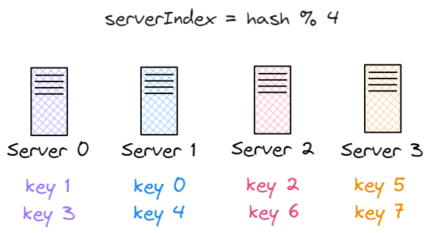
This method works well as long as the number of servers stays the same, and the data distribution is even. But here's the catch: if we add or remove servers, things break down. For instance, let's say **server 1 goes offline**, and now we only have **3 servers**. We're still using the same hash function, so each key still gets the same hash value, but because we're now doing `hash(key1) % 3`, most keys will be assigned to **different servers**. Here’s how the new server assignments would look after reducing the pool to 3 servers:

| key  | hash     | hash % 3 |
| ---- | -------- | -------- |
| key0 | 18358617 | 0        |
| key1 | 26143584 | 0        |
| key2 | 18131146 | 1        |
| key3 | 35863496 | 2        |
| key4 | 34085809 | 1        |
| key5 | 27581703 | 0        |
| key6 | 38164978 | 1        |
| key7 | 22530351 | 0        |

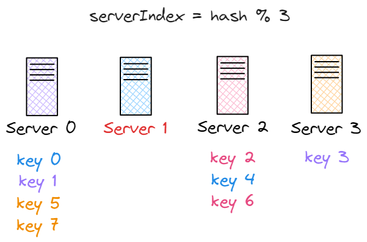
As shown in the figure above, most of the keys are now mapped to different servers, not just the ones that were originally stored on the failed server (server 1).
You can tell where each key originally belonged by its color. This highlight an important issue: even though the data itself hasn't changed, clients may now be looking in the wrong places. That leads to a surge in cache miss, increased latency, and unnecessary load on the system.
This is exactly the kind of problem that **consistent hashing** is designed to solve.
## Consistent Hashing

> “**Consistent hashing** is a special kind of [hashing](https://en.wikipedia.org/wiki/Hash_function "Hash function") technique such that when a [hash table](https://en.wikipedia.org/wiki/Hash_table "Hash table") is resized, only n/m keys need to be remapped on average where n is the number of keys and m is the number of slots. In contrast, in most traditional hash tables, a change in the number of array slots causes nearly all keys to be remapped.”
> — [Wikipedia](https://en.wikipedia.org/wiki/Consistent_hashing)
### Hash space and hash ring
Now that we know what consistent hashing is, let's see how it actually works behind the scenes.
When a hash function like SHA-1 is used, it maps every input (like a server or a key) to a number in a huge range, from `0` to `2^160-1`. We call this range the **hash space**.
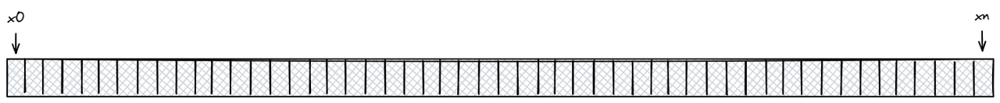
Since this space is too large to draw as a straight line, we often imagine it as a circle, where the smallest and largest values are next to each other. This circle is called the **hash ring**.
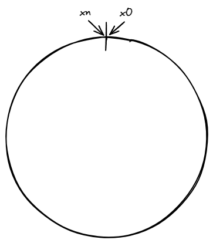
### Hash servers
Now we treat the servers (typically their IPs or names) as input to the same hash function `f`. The resulting hash values are then mapped onto the ring, as shown in the figure below.
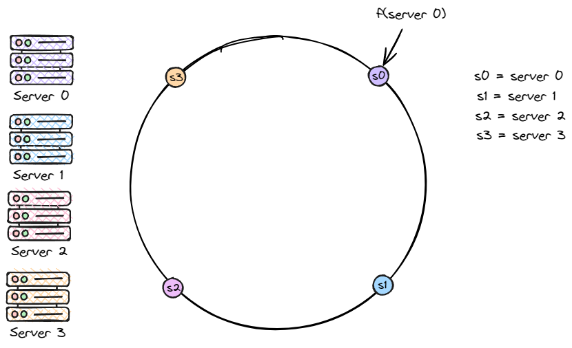
### Hash keys
Just like we did with the servers, we now place the 4 keys (key0 to key3) onto the hash ring, as shown below.
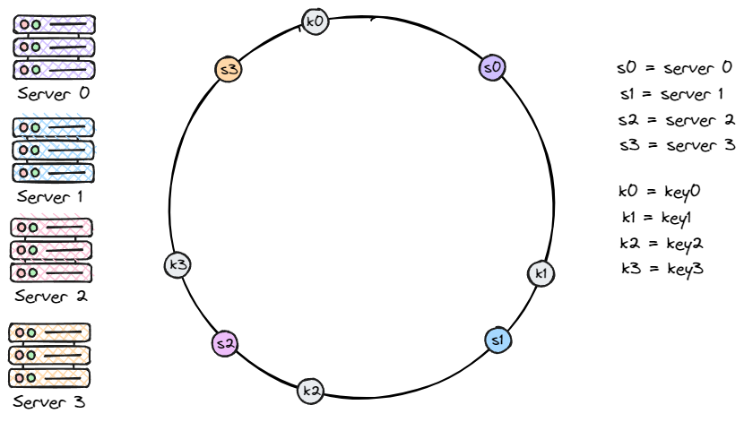
### Server lookup
So how do we know which server stores which key? It's simple: just start from the key's position on the ring, then move clockwise until we hit a server. For example, in the figure below: key0 lands on server0, key1 on server 1, key2 on server2, and key3 on server 3.
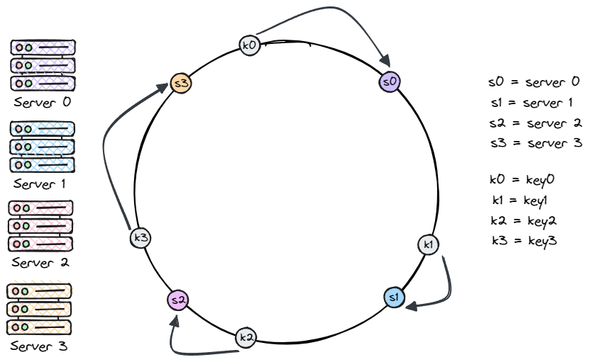
### Add a server
This approach solves the problem of too many keys being moved when we add a new server.  
In the diagram below, adding server 4 only affects key0, it's the first server that key0 hits when we go clockwise.  
The rest (key1, key2, key3) stay where they are. Neat, right?
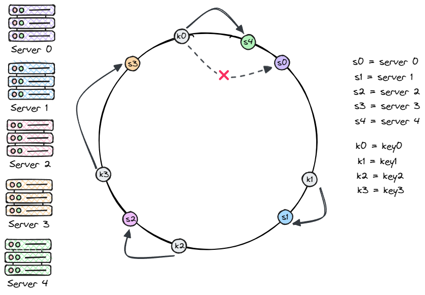
### Remove a server
In the same way, if a server goes offline, only a small number of keys are affected. In the diagram below, when _server 1_ is removed, only _key1_ moves to _server 2_. All other keys stay where they are.
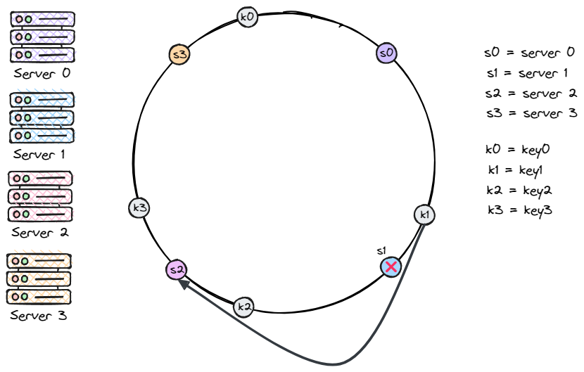
### Issues in the basic approach
The basic steps of consistent hashing are:
- Map servers and keys onto the ring using a uniformly distributed hash function.
- From the position of a key, go clockwise until the first server is found that server will store the key.
However, there are two main issues with this approach:
1. When a server is added or removed, it's difficult to keep the ring evenly partitioned. For example, in the situation above where _server 1_ is removed, the segment assigned to _server 2_ becomes much larger than those of _server 0_ and _server 3_.
2. As a result, keys are distributed unevenly. _Server 2_ ends up storing most of the keys, while _server 0_ and _server 3_ hold very few or none.
That’s where _virtual nodes_ (or _replicas_) come in.
### Virtual Nodes
Now, instead of being represented by a single node, each server is represented by **multiple virtual nodes** on the ring. As shown in the figure below, both _server 1_ and _server 3_ have three virtual nodes each. In real-world systems, the number of virtual nodes per server is usually much higher.
For example, _server 0_ is now represented by _s0-0_, _s0-1_, and _s0-2_ on the ring. Similarly, _s1-0_, _s1-1_, and _s1-2_ represent _server 1_. Each of these virtual nodes is responsible for a portion of the hash ring.
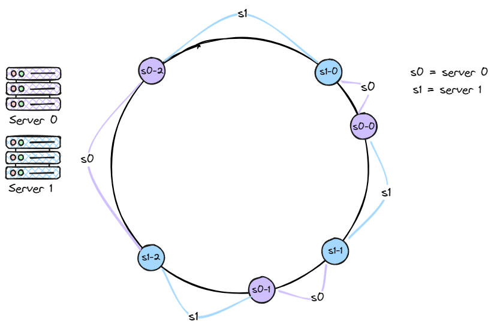
The same method is used to determine where a key is stored: go clockwise from the key’s position until a virtual node is found. In the figure below, we can see that _k0_ lands on _s1-1_, which belongs to _server 1_.
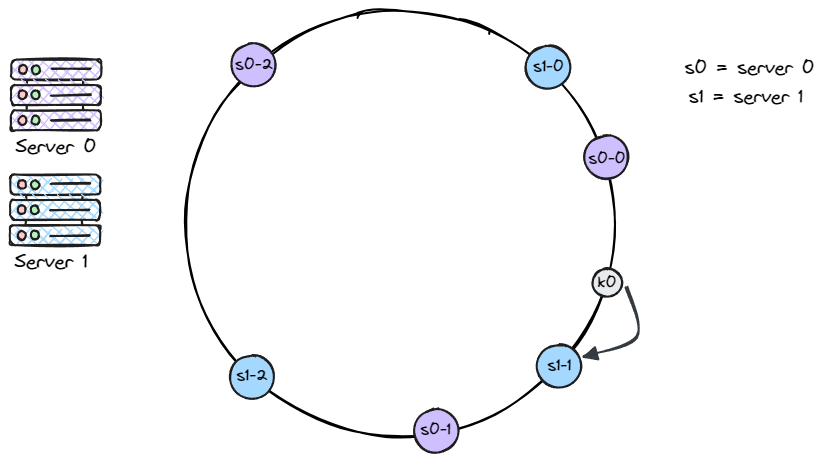
Increasing the number of virtual nodes helps balance the distribution of keys across servers. This is because more virtual nodes reduce variation, making the distribution more even.
For example, a study shows that with 100–200 virtual nodes, the standard deviation drops to 5–10% of the mean. While adding more virtual nodes improves balance, it also increases metadata overhead. So the number of virtual nodes should be tuned based on system needs.
## TL;DR:
Consistent hashing is a smart way to distribute data across servers with minimal disruption when servers are added or removed. By mapping keys and servers onto a hash ring — and using virtual nodes — we can achieve better load balancing and system scalability with fewer cache misses. It’s a core concept behind many scalable systems today, and definitely worth understanding deeply.
