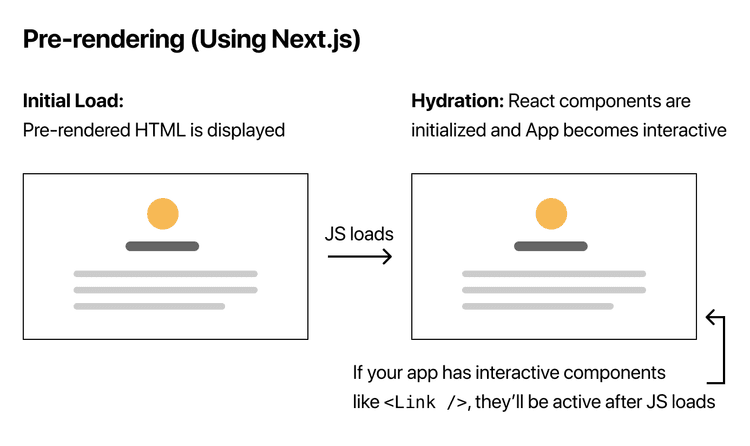
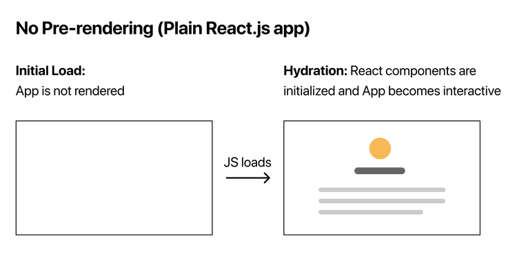
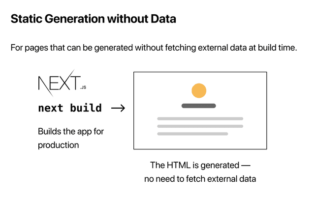
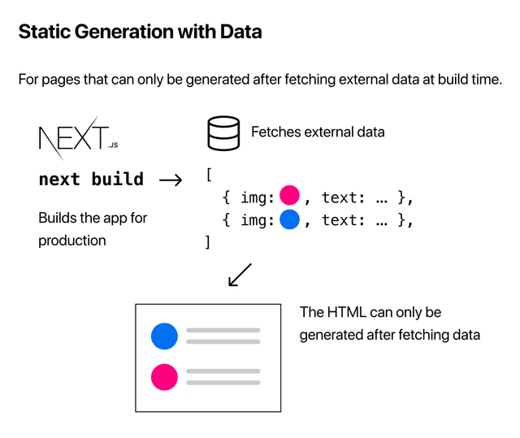
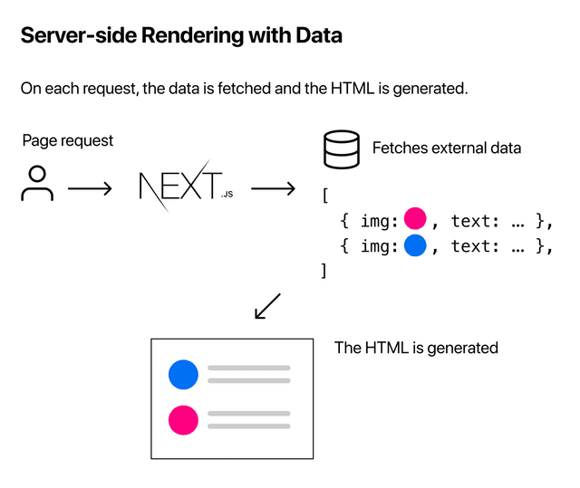
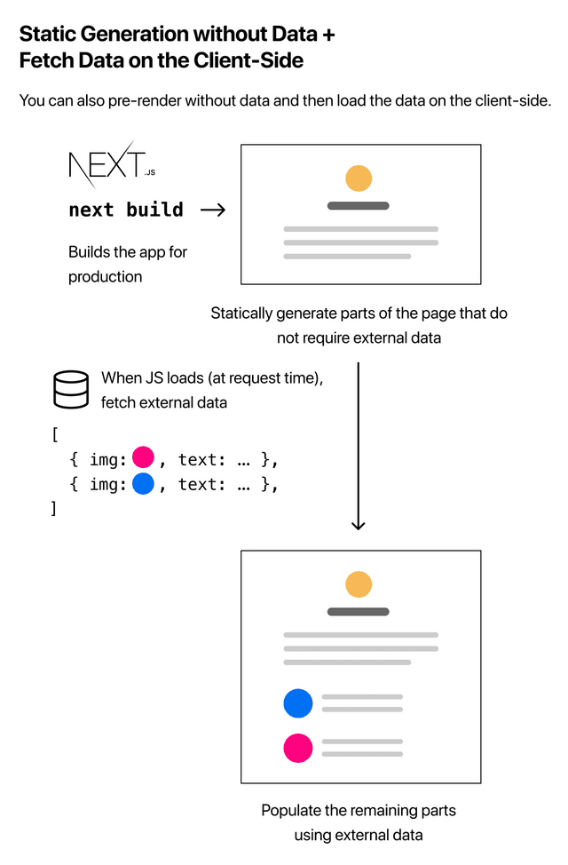

## Giới thiệu

Hello các bạn, nếu các bạn có tìm hiểu hoặc đọc qua về Next.js thì sẽ biết rằng điểm đặc biệt của React framework này đó là Pre-rendering. Bài viết này mình sẽ bàn luận về Pre-rendering và Data Fetching trong Next.js, cùng với đó chúng ta sẽ tìm hiểu về Static Generation.

## Pre-rendering

Mặc định, Next.js sẽ pre-renders các trang, có nghĩa là *HTML sẽ được tạo trước cho từng trang, thay vì tất cả được thực hiện ở client-side bởi JavaScript*. Pre-rendering nâng cao hiệu năng của trang web và SEO (search engine optimization)





### Phân loại Pre-rendering

Next.js có 2 loại pre-rendering: [Static Generation](https://nextjs.org/docs/basic-features/pages#static-generation-recommended) và [Server-side Rendering](https://nextjs.org/docs/basic-features/pages#server-side-rendering). Sự khác biệt của 2 loại là thời điểm mà HTML được tạo cho một trang.

- [Static Generation](https://nextjs.org/docs/basic-features/pages#static-generation-recommended) sẽ tạo HTML tại thời điểm **build time**. Trang HTML được pre-render sau đó sẽ được tái sử dụng sau mỗi lần request.
-  [Server-side Rendering](https://nextjs.org/docs/basic-features/pages#server-side-rendering) là phương pháp pre-redering tạo HTML mới sau mỗi lần request.

### Khi nào sử dụng Static Generation và Server-side Rendering

Static Generation được khuyên dùng trong hầu hết trường hợp, vì trang web sẽ được build một lần và sau đó lưu trữ bởi CDN, phương pháp này giúp cho tốc độ của trang được tối ưu so với việc trang web được server render lại sau mỗi lần request. Một số trường hợp bạn có thể ứng dụng Static Generation như: `web marketing, bài đăng blog, trang sản phẩn E-commerce hay documentation`.

Tóm lại, nếu bạn cho rằng mình có thể pre-render trang web này trước request của người dùng, thì khả năng cao bạn nên dùng Static Generation. Mặt khác, nếu trang web thường xuyên cập nhật data hoặc là nội dung trang web thay đổi sau mỗi request thì chúng ta nên dùng Sever-side Rendering, điều này đảm bảo trang web sẽ luôn được cập nhật sau mỗi request. Ngoài ra, chúng ta cũng có thể sử dụng client-side rendering với JavaScript để xử lý dữ liệu cập nhật.

Ở nội dung bài viết này, chúng ta sẽ tập trung vào Static Generation, sau đó mình sẽ nói qua về fetching dữ liệu tại thời điểm Request.

## Static Generation

### Static Generation khi không có data

Với những trang web không yêu cầu tìm nạp dữ liệu từ bên ngoài, Next.js sẽ tự động thực hiện Static Generation đối với trang đấy và HTML sẽ được tạo tại thời điểm build time.



### Static Generation có data

Tuy nhiên, đối với nhiều trang web, chúng ta mong đợi việc có thể fetch dữ liệu từ bên ngoài để render ra HTML, có thể là sử dụng API, dữ liêụ từ file systems, hoặc truy xuất cơ sở dữ liệu tại thời điểm build time,... Và Next.js cho bạn phương thức để thực hiện điều này.



**Static Generation có Data với `` `getStaticProps` ``**

Để sử dụng getStaticProps, khi bạn export một page component, bạn có thể đồng thời export một `async` function là `getStaticProps`. Sau đó:

- `getStaticProps` chạy tại thời điểm build time trong môi trường production.
- Ở trong function này, chúng ta có thể tìm nạp data từ bên ngoài và gửi nó dưới dạng props cho page.

```js
export default function Home(props) { ... }

export async function getStaticProps() {
  // Get external data from the file system, API, DB, etc.
  const data = ...

  // The value of the `props` key will be
  //  passed to the `Home` component
  return {
    props: ...
  }
}
```

Về cơ bản, getStaticProps cho phép bạn nói với Next.js rằng: *"Này, trang này đang cần một số dữ liệu từ bên ngoài, vì thế khi bạn pre-render nó ở thời điểm build time, hãy chắc chắn rằng xử lý điều đấy trước!"*

> **Lưu ý:** Ở trong môi trường development, getStaticProps khởi chạy sau mỗi request.

Ví dụ với getStaticProps: Ở trong file `pages/post/index.js`, export ra function `Posts` đồng thời export function `getStaticProps`. Trong hàm `getStaticProps`, mình lấy dữ liệu posts từ API `https://jsonplaceholder.typicode.com/posts`, hàm trả về object `props` có chứa `posts`, sau đó `posts` được truyền vào làm props của `Posts` component. Cuối cùng, `posts` dùng để render ra giao diện.

```jsx
import Link from "next/link";

export default function Posts({ posts }) {
  return (
    <>
      <h1>List of Posts</h1>
      {posts.map((post) => (
        <div key={post.id}>
          <Link href={`posts/${post.id}`}>
            <h2>
              {post.id} {post.title}
            </h2>
          </Link>
          <hr />
        </div>
      ))}
    </>
  );
}

export async function getStaticProps() {
  let response = await fetch("https://jsonplaceholder.typicode.com/posts");
  let posts = await response.json();
  return {
    props: {
      posts,
    },
  };
}

```

## Fetching Data tại thời điểm Request

### Server-side Rendering

Nếu bạn muốn fetch dữ liệu tại **request time** thay vì **build time**, bạn có thể dùng [Server-side Rendering](https://nextjs.org/docs/basic-features/pages#server-side-rendering):



Để sử dụng Server-side Rendering, bạn cần export `getServerSideProps` thay vì `getStaticProps`.

**Sử dụng `` `getServerSideProps` ``**

Đoạn code export ra `async` function `getServerSideProps` được mô tả như sau:

```jsx
export async function getServerSideProps(context) {
  return {
    props: {
      // props for your component
    },
  };
}
```

Bởi vì  `getServerSideProps` được gọi tại request time, tham số `context` của nó sẽ chứa các tham số cụ thể của request.

Bạn chỉ nên sử dụng `getServerSideProps` khi mà trang của bạn cần pre-render với dữ liệu được fetch tại request time. Time to first bite ([TTFB](https://web.dev/time-to-first-byte/)) hay thời gian phản hồi của máy chủ sẽ chậm hơn so với `getStaticProps` vì máy chủ cần thực hiện tính toán và trả ra kết quả với mỗi request, kết quả vì thế sẽ không được lưu vào bộ đệm bởi [CDN](https://vercel.com/docs/edge-network/overview) mà không cấu hình.

### Client-side Rendering

Nếu bạn không cần phải render trước dữ liệu, bạn có thể sử dụng [Client-side Rendering](https://nextjs.org/docs/basic-features/data-fetching#fetching-data-on-the-client-side)

- Pre-render bằng phương pháp Static Generation những phần của trang mà không yêu cầu dữ liệu từ bên ngoài.
- Trong quá trình tải trang, fetch dữ liệu từ bên ngoài từ client bằng JavaScript và hoàn tất các phần còn lại của trang.



**Client-side Rendering** có thể ứng dụng vào các trang web mang tính bảo mật, không có nhu cầu về SEO, và đặc biệt là không cần render trước (pre-render). Dữ liệu của trang cập nhật thường xuyên, yêu cầu fetch data tại request-time.

## Tổng kết

Trong bài viết này, mình đã nói về Pre-rendering và Data Fetching trong Next.js. Pre-rendering có 2 loại là Static Generation và Server-side Rendering, trong đó Static Generation được khuyên dùng và mình cũng nói về Data Fetching của phương pháp này. Ngoài ra, bạn cũng có thể lựa chọn Server-side Rendering hoặc Client-side Rendering tùy vào nhu cầu fetching data của trang web.

Cảm ơn các bạn đã theo dõi và chúc các bạn học code vui vẻ! 👋


Nguồn tham khảo: trang web chính thức của [Next.js](https://nextjs.org/)
